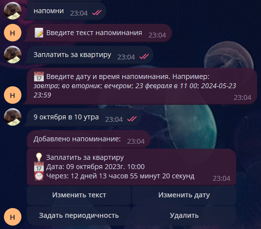
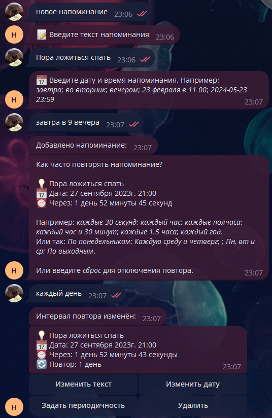

# Бот напоминаний в Telegram

## Оглавление

- [Описание](#Описание)
- [Как пользоваться](#Как-пользоваться)
    - [Добавление напоминания](#Добавление-напоминания)
    - [Просмотр текущих напоминаний](#Просмотр-текущих-напоминаний)
    - [Редактирование / удаление](#Редактирование--удаление)
- [Скриншоты](#Скриншоты)
- [Запуск / разработка](#Запуск--разработка)
    - [Требования](#Требования)
    - [Запуск через Docker Compose](#Запуск-через-Docker-Compose)
    - [Запуск окружения разработки](#Запуск-окружения-разработки)

## Описание

Бот напоминаний для Telegram. Позволяет создавать напоминания с указанием даты и времени на естественном языке, а также
регулярности повтора. Напоминания могут быть как одноразовыми, так и повторяющимися.

## Как пользоваться

### Добавление напоминания

Напишите боту одну из следующих фраз: `Напомни`, `/remind`, `Добавить`, `/add`, `Создать`, `/create`, `Новое`, `/new`

### Просмотр текущих напоминаний

Напишите боту одну из следующих фраз: `Напоминания`, `/reminders`, `Список`, `/list`, `Все`, `/all`

### Редактирование / удаление

Когда бот пришлёт вам ваше напоминание когда оно сработает или когда вы попросите полный список, - вы можете
использовать кнопки под напоминанием для изменения текста напоминания, даты, регулярности повтора или удаления
напоминания.

### Скриншоты




## Запуск / разработка

### Запуск через Docker Compose

### Требования:

- [Docker](https://www.docker.com/)

```bash
# 0. Склонируйте репозиторий и откройте директорию с ним:
git clone https://github.com/KoJem9Ka/tg_reminders_bot.git
cd tg_reminders_bot
# 1. Перед тем как заполнить токен бота начните сборку приложения и загрузку образа БД:
docker-compose build && docker-compose pull
# 2. Скопируйте `.env.example` как `.env.prod`, а затем
cp .env.example .env.prod
# 3. Измените следующие переменные в .env.prod:
MODE=prod
DB_HOST=database
DB_PORT=5432
BOT_TOKEN=токен вашего бота
# 4. Запустите БД и создайте в ней схему. Её данные будут храниться по пути `./dev-utils/db_data_prod`.
docker-compose up -d database
npm run prisma:prod:migrate
# 5. Запустите приложение. После выполнения этой команды Вы можете написать своему боту «Привет!!!».
docker-compose up -d
```

### Запуск окружения разработки

### Требования:

- [NodeJS LTS](https://nodejs.org)
- [Docker](https://www.docker.com/) / [PostgreSQL >=14](https://www.postgresql.org/)

```bash
# 0. Склонируйте репозиторий и откройте директорию с ним:
git clone https://github.com/KoJem9Ka/tg_reminders_bot.git
cd tg_reminders_bot
# 1. Скачайте образ БД и установите зависимости:
docker-compose pull && npm install
# 2. Пока зависимости устанавливаются Вы можете заполнить переменные окружения. Скопируйте `.env.example` как `.env.prod` и укажите в нём `BOT_TOKEN`:
cp .env.example .env.dev
# 3. Запустить контейнер с БД и создайте в ней схему. Её данные будут храниться по пути `./dev-utils/db_data_dev`.
docker-compose -f dev-utils/docker-compose.db-dev.yml up -d
npm run prisma:dev:push
# 4. Запустите приложение. После выполнения этой команды Вы можете написать своему боту «Привет!!!».
npm run start:dev
```
